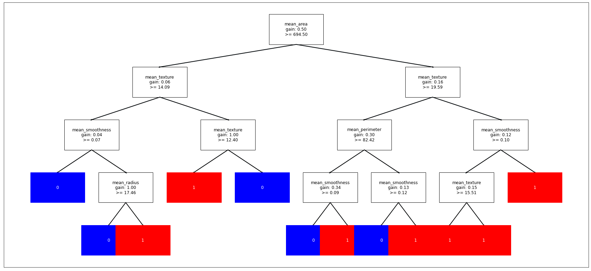

# DecisionTreeImplementation

Implementing Decision Tree Classifier from scratch using python.

This is an OOP approach with numpy and pandas.  

## Criteria
There's an implementation for the most 2 famous impurity measures for calculating information gain.

**1- Gini-index:**  
> A measure how often a randomly chosen element from the set would be incorrectly labeled.


**2- Entropy:**  
> A measure of the purity *(or impurity)* of a set *(or sub-split)*.


## Visualization
You can draw the tree you built using the ```dt.draw_tree()``` method.

*Example*:
<p align="center">

</p>

## Evaluation
The DecisionTreeClassifier was tested on the breast cancer data with both, entropy and gini-index criteria, and by changing the trea's maximum depth.
It was trained on *75%* of the data, and tested on *25%* of the data.

It gave an **accuracy of 95.45%** on the testing data.

## License
[MIT](https://choosealicense.com/licenses/mit/)
